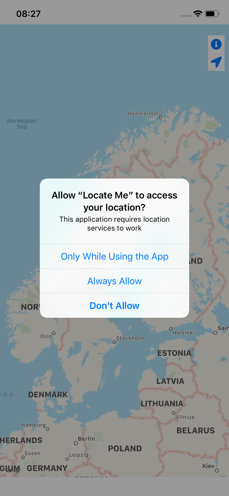
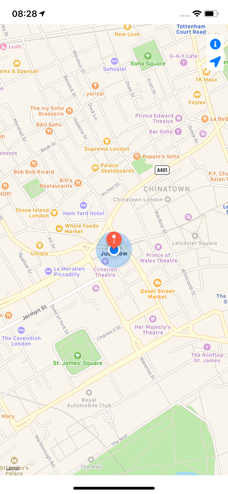

#  Locate Me

Locate Me is an app to help users location each other using the phones location to show all active users location on a map.

## Getting Started

There are no extra steps required to get started, since all the pods are included in the vcs

### Prerequisites

```
cocoapods: 1.6.1
xcode: 10.2.1
swift: 5
```

## App Usage 

When the app starts for the first time, the users are met with the splash screen.

The splash screen logs the user to firebase as an anonymous user.


The next screen after a user successfully logs in is the map view, here the user will be asked to share location access permissions so that the application can share the users location with everyone else.



On the map screen there are two buttons, one to center on the users location and one to open the settings screen.


The settings screens gives the user the option to log out. Logging out stops the app from sharing the users location and shows the login screen.

The login screen has a single button, log in, which will log in the user anonymously again as a completely new user. Until the user logs in again, the users location will not be shared with everyone else.

# License

The contents of this repository are covered under the [MIT License](LICENSE).


